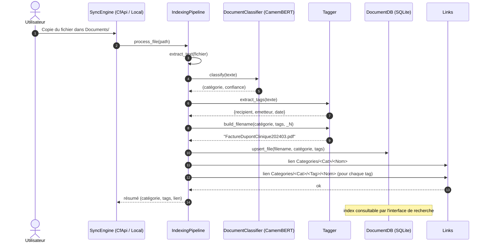
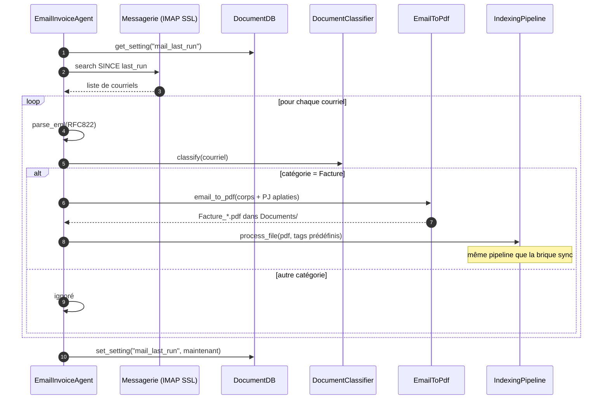
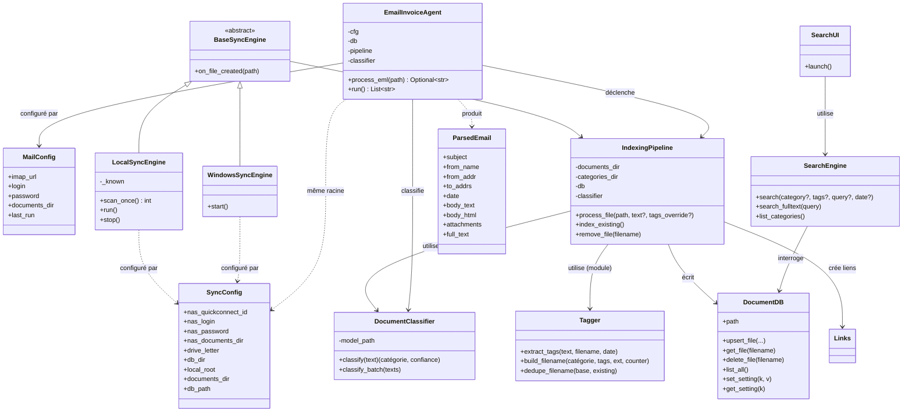

# Architecture — Recherche Documentaire

## 1. Objectif

L'outil « Recherche Documentaire » facilite la recherche de documents par
**catégorie** et par **tags**. Un document copié dans le répertoire `Documents`
est automatiquement :

1. **classé** dans une catégorie (CamemBERT) — Facture, Philosophie, Religion,
   Photo, Vidéo, Ordonnance, Résultat, Autre ;
2. **taggé** — destinataire (`recipient`), émetteur (`emetteur`), date
   principale (`YYYYMM`) ;
3. **indexé** dans une base SQLite cachée ;
4. **exposé** dans une arborescence de liens `Categories/<Catégorie>/<Tag>/`
   pointant vers le fichier physique, ce qui permet de retrouver un document
   *nativement dans l'explorateur*, sans interface de recherche ;
5. **interrogeable** via une interface de recherche (combinaisons catégorie +
   tags + mots-clés).

Un **agent IA courriel** complète le dispositif : il scrute la messagerie
personnelle, détecte les factures, les convertit en PDF (aspect original
conservé, pièces jointes aplaties) et les dépose dans `Documents` — déclenchant
ainsi le même pipeline d'indexation.

## 2. Vue d'ensemble des modules

```
recherche_doc/
├── __init__.py          # Taxonomie : catégories, synonymes, règles de tags
├── config.py            # Chargement YAML (sync + mail)
├── classifier.py        # Classification CamemBERT + repli lexical
├── tagger.py            # Extraction des tags, construction des noms
├── extractors.py        # Extraction de texte (PDF, DOCX, images, ...)
├── database.py          # SQLite cachée (files + FTS5 + settings)
├── pipeline.py          # Orchestration : classifier → tagger → DB → liens
├── links.py             # Création des liens (symlink/hardlink/copie)
├── sync_engine.py       # Moteurs de synchro (local + factory Windows)
├── windows_provider.py  # Provider Cloud Sync Engine (CfApi via ctypes)
├── search/explorer_plugin.py  # Plugin explorateur : verbe + registre HKCU
├── app.py               # Point d'entrée service (MSI)
├── cli.py               # CLI : index, watch, search, gui, mail-run, import-eml
├── search/
│   ├── engine.py        # Recherche SQL (filtres) + FTS5 (plein texte)
│   ├── ui.py            # UI Tkinter + squelette plugin explorateur
│   ├── gui_app.py       # Point d'entrée GUI (MSI)
│   └── explorer_hook.py # Entrée du plugin explorateur
└── email_agent/
    ├── eml.py           # Parsing .eml / IMAP (corps, pièces jointes)
    ├── pdf.py           # Courriel → PDF (corps + pièces jointes aplaties)
    └── agent.py         # Agent : scrutation IMAP, classification, import
```

## 3. Choix techniques

| Sujet | Choix | Justification |
|---|---|---|
| Classification | **CamemBERT** (`camembert-base`, fine-tunable) | Exigé par la spécification ; modèle FR de référence. `DocumentClassifier` accepte un modèle fine-tuné `CamembertForSequenceClassification` ; à défaut, repli lexical pondéré par synonymes (déterministe, testable sans GPU) |
| Cohérence sync/courriel | **même classifieur, même taxonomie** partagés | Garantit qu'un courriel classé « Facture » par l'agent le sera aussi par le plugin Cloud Sync Engine (exigence explicite de la spec) |
| Base de données | **SQLite** (+ FTS5) | Libre, embarquée, sans serveur, requête plein texte native. Stockée dans un répertoire **caché** (préfixe `.`) |
| Sync Windows | **Cloud Sync Engine API (CfApi)** via **ctypes** (`windows_provider.py`) | Extension du système de fichiers montée sur une lettre de drive ; enregistrement du sync root (`CfRegisterSyncRoot`), connexion (`CfConnectSyncRoot`), création de placeholders (`CfCreatePlaceholders`), hydratation à la demande (`CfHydratePlaceholder`) ; répertoires virtuels Catégorie/Tag natifs dans l'explorateur. *Statut : implémenté, non testé hors Windows — les appels nécessitent un système de fichiers NTFS et un runner Windows* |
| Plugin explorateur | **Verbe shell** (`search/explorer_plugin.py`) + clé WiX dans le MSI | Commande « Recherche Documentaire... » au menu contextuel des lecteurs (HKCU, sans élévation) ; `%V` passe le dossier visité → pré-filtrage catégorie/tag de la GUI ; enregistré par le MSI et auto-réparé au premier lancement (`--register/--unregister/--status`) |
| Liens | symlink POSIX / hardlink Windows (repli copie) | Point N vers 1 fichier physique ; en mode CfApi, les entrées Catégorie/Tag sont des entrées virtuelles du provider |
| Extraction texte | pypdf, OOXML (zip), EXIF | Multi-format sans dépendances lourdes ; extensible |
| PDF courriels | reportlab + pypdf | Corps rendu en pages PDF (mise en forme d'origine si convertisseur HTML disponible), pièces jointes converties puis **aplaties** en pages supplémentaires |
| GUI | Tkinter | Standard, aucune dépendance ; opère aussi bien standalone que compagnon du drive |
| Packaging | PyInstaller + **WiX v3** (MSI) | Installation per-machine silencieuse, properties MSI mappées sur `config.yaml` |

## 4. Diagramme de séquence — import d'un document



## 5. Diagramme de séquence — agent courriel



## 6. Diagramme de classes



## 7. Flux de données et invariant

- **Source de vérité** : le fichier physique dans `Documents/` (nom original).
- **Index** : la base SQLite fait foi pour catégorie/tags/date/personnes.
- **Vues** : `Categories/<Catégorie>/[<Tag>/]` ne contiennent que des liens
  vers la source de vérité — jamais de copie de référence (repli copie
  uniquement si le système de fichiers refuse les liens).
- **Nommage** dans les vues : `<Catégorie><Recipient><Emetteur><YYYYMM>(_N)?.<ext>`
  (extension d'origine conservée, compteur d'unicité `_N`).

## 8. Points d'extension

| Extension | Comment |
|---|---|
| Nouvelle catégorie | ajouter à `CATEGORIES` + `CATEGORY_SYNONYMS` (`__init__.py`) ou fine-tuner le modèle et fournir `model_path` |
| Nouveau tag | ajouter une regex à `TAG_RULES`/`tagger.py` puis étendre `build_filename` |
| Nouveau format de fichier | ajouter un extracteur à `extractors.py` |
| Convertisseur HTML→PDF haute fidélité | brancher `_html_to_pdf_bytes` (`email_agent/pdf.py`) sur weasyprint/wkhtmltopdf |
| Autre messagerie (Graph, POP3) | implémenter un `run()` alternatif dans `EmailInvoiceAgent` |
