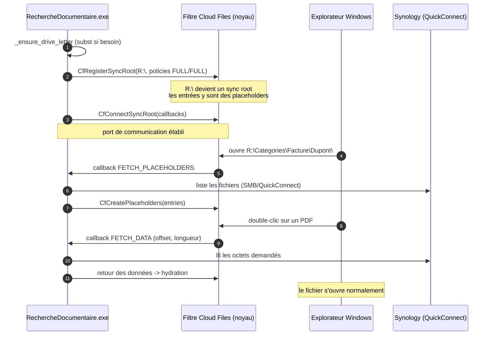
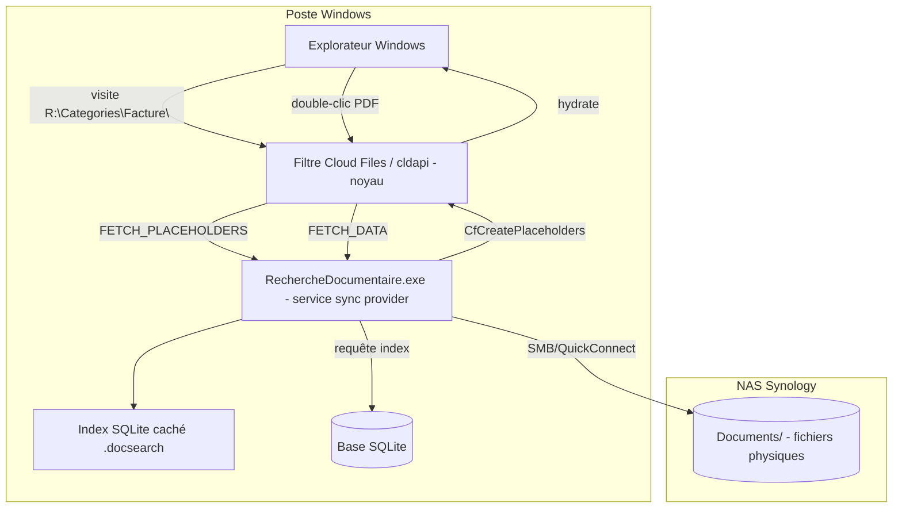

# Cloud Sync Engine API (CfApi) — Guide d'usage et intégration

Ce document explique comment l'outil « Recherche Documentaire » utilise la
**Cloud Sync Engine API** (CfApi, `cldapi.dll`) de Windows pour monter le NAS
Synology sur une lettre de drive et servir l'arborescence virtuelle
`Documents/` + `Categories/<Catégorie>/<Tag>/`.

Implémentation : [`recherche_doc/windows_provider.py`](../recherche_doc/windows_provider.py)

---

## 1. Concepts CfApi

| Concept | Définition | Rôle dans notre outil |
|---|---|---|
| **Sync root** | Répertoire racine enregistré auprès de CfApi ; devient la frontière du « cloud » | `<Drive>:\` (ex. `R:\`) — le drive entier est un sync root |
| **Placeholder** | Entrée de fichier/répertoire « vide » : les métadonnées existent, le contenu est dans le cloud | Fichiers du NAS ; liens `Categories/...` |
| **Hydration** | Téléchargement du contenu réel à l'ouverture | Ouverture d'un document → lecture depuis le NAS via QuickConnect |
| **Dehydration** | Libération du contenu local (métadonnées conservées) | Optionnel (politique d'espace disque) |
| **Pin / Unpin** | État par fichier : toujours disponible / en ligne uniquement | Non utilisé (politique FULL par défaut) |
| **Sync provider** | Processus qui répond aux requêtes du filtre de fichiers (callbacks) | `RechercheDocumentaire.exe` (service en mode `--mode sync`) |
| **Filter communication port** | Canal noyau entre le filtre Cloud Files et le provider | Établi par `CfConnectSyncRoot` |

## 2. Cycle de vie d'un sync root



## 3. Politiques déclarées

Dans `_register_sync_root` (structures `CF_SYNC_POLICIES`) :

| Politique | Valeur | Effet |
|---|---|---|
| `Hydration` | `CF_HYDRATION_POLICY_FULL (2)` | Le provider contrôle *toute* la lecture : CfApi ne tente rien seul, il demande tout via `FETCH_DATA`. Permet de router les lectures vers le NAS |
| `Population` | `CF_POPULATION_POLICY_FULL (3)` | CfApi n'énumère jamais `Categories/` lui-même : chaque visite de répertoire déclenche `FETCH_PLACEHOLDERS` que notre provider remplit (d'où les répertoires par catégorie/tag) |
| `InSync` | défaut | État de synchronisation géré par le provider |
| `HardLink` | interdit | Les liens catégorie/tag sont des *entrées distinctes* servies par le provider, pas des hardlinks NTFS |

**Pourquoi FULL/FULL** : c'est ce qui rend les répertoires
`Categories/<Catégorie>/<Tag>/` possibles — CfApi nous demande le contenu de
chaque répertoire visité et nous le servons depuis la base SQLite (index),
tandis que les fichiers physiques restent dans `Documents/` sur le NAS.

## 4. Callbacks et notre implémentation

Le provider doit répondre aux callbacks déclarés à la connexion
(`CfConnectSyncRoot` reçoit une table `CF_CALLBACK[]`). Principaux :

| Callback | Déclenché quand | Notre réponse |
|---|---|---|
| `FETCH_PLACEHOLDERS` | énumération d'un répertoire du sync root | Interroge la base : pour `Categories\<Cat>\` → un lien par fichier de la catégorie ; pour `Categories\<Cat>\<Tag>\` → un lien par fichier taggé ; pour `Documents\` → fichiers du NAS |
| `FETCH_DATA` | lecture d'un placeholder (offset/longueur) | Lit les octets correspondants sur le NAS et les renvoie |
| `NOTIFY_DELETE` | suppression par l'utilisateur | Retire le fichier de l'index (et les liens orphelins) |
| `NOTIFY_UPDATE` | modification de métadonnées | Met à jour la base (date, taille) |
| `CANCEL` | annulation d'une hydration en cours | Interrompt la lecture réseau en cours |

Structure de la table (cfapi.h) :

```c
typedef struct CF_CALLBACK {
    CF_CALLBACK_TYPE Type;
    PVOID Callback;   // pointeur de fonction
} CF_CALLBACK;
```

**État de l'implémentation** : `CfApiBindings` déclare toutes les signatures
ctypes (register/unregister/connect/disconnect, create/update/convert
placeholders, hydrate) et `WindowsSyncEngine` fait l'enregistrement, la
connexion et la publication des liens après indexation
(`publish_links`). La **table de callbacks complète** (marshalling ctypes
des structures `CF_CALLBACK_PARAMETERS`, boucle de réponse) reste à
brancher — c'est le seul chantier CfApi restant ; elle nécessite un
développement itératif sur Windows.

## 5. API utilisées — signatures

| Fonction cldapi.dll | Signature (résumée) | Usage dans le code |
|---|---|---|
| `CfRegisterSyncRoot` | `(LPCWSTR root, CF_SYNC_REGISTRATION*, CF_SYNC_POLICIES*, LPCVOID, DWORD) → HRESULT` | `_register_sync_root` : déclare `R:\` comme sync root |
| `CfUnregisterSyncRoot` | `(LPCWSTR) → HRESULT` | Démontage propre (arrêt du service) |
| `CfConnectSyncRoot` | `(LPCWSTR, CF_CALLBACK*, LPCVOID, flags, PHANDLE) → HRESULT` | `_connect` : ouvre le port avec le filtre |
| `CfDisconnectSyncRoot` | `(HANDLE) → HRESULT` | `shutdown` |
| `CfCreatePlaceholders` | `(LPCWSTR, CF_PLACEHOLDER_CREATE_INFO[], DWORD, ...) → HRESULT` | `publish_links` : liens virtuels catégories/tags |
| `CfHydratePlaceholder` | `(LPCWSTR, offset, len, CF_HYDRATE_FLAGS, ...) → HRESULT` | `hydrate` : pré-remplit un fichier |
| `CfUpdatePlaceholder` | — | Mise à jour des métadonnées d'un lien |
| `CfConvertToPlaceholder` | — | Convertit un fichier réel (NAS synchronisé) en placeholder |

Chaque HRESULT non nul est converti en `OSError` par `CfApiBindings.hresult`.

## 6. Schéma de l'architecture de bout en bout sur Windows



## 7. Démarrage / arrêt du provider

```bat
:: service (fourni par le MSI)
RechercheDocumentaire.exe --mode sync

:: diagnostic : une seule scrutation puis arrêt
RechercheDocumentaire.exe --scan-once
```

À l'arrêt (`shutdown`) : `CfDisconnectSyncRoot` puis, si souhaité,
`CfUnregisterSyncRoot` pour libérer la lettre de drive.

## 8. Prérequis et limites

- Windows 10 1709+ / Windows 11 / Windows Server 2019+ ;
- volume NTFS ;
- le provider doit tourner en continu (sinon : entrées visibles mais
  « indisponibles » et hydration bloquée) ;
- sans CfApi (Linux/dev), `LocalSyncEngine` reproduit le comportement avec
  des symlinks — même pipeline, même base, mêmes tests ;
- le montage sur lettre libre est géré par `_ensure_drive_letter` (repli
  `subst`) ; en production, la lettre doit être réservée à l'outil.

## 8bis. Compatibilité NAS / systèmes de fichiers

Le FS du NAS est sans impact sur CfApi : le sync root, les placeholders et
les liens `Categories/` vivent sur le **volume NTFS local** du poste, jamais
sur le NAS. Celui-ci n'est lu/écrit que comme octets via SMB/QuickConnect
(politique `HYDRATION_POLICY_FULL` : toutes les lectures transitent par le
provider).

Points d'attention :

- **ext2 (non journalisé)** : risque de perte de données du NAS lui-même
  après coupure brutale (fsck). Migrer en ext4/btrfs recommandé — sans
  impact sur l'intégration CfApi.
- **Ne pas confondre** : si `local_root` pointe sur un montage SMB (mode
  simulation), CfApi ne s'applique pas et les liens basculent en copies ;
  le vrai mode CfApi utilise toujours un volume NTFS local.
- La base SQLite reste locale ; jamais sur un partage réseau.

## 9. Références

- Microsoft Docs — *Cloud Sync Engine API* (cldapi.dll), cfapi.h du SDK ;
- `CF_SYNC_REGISTRATION`, `CF_SYNC_POLICIES`, `CF_CALLBACK` (cfapi.h) ;
- Code : [`recherche_doc/windows_provider.py`](../recherche_doc/windows_provider.py),
  [`recherche_doc/sync_engine.py`](../recherche_doc/sync_engine.py).
